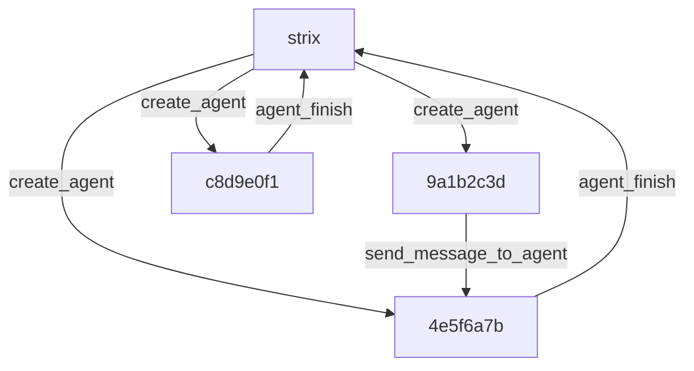

# The graph of agents

## Overview

Strix models multi-agent work as a tree. The root agent is named `strix`, and every child agent gets a short 8-hex id under that root. The `AgentCoordinator` in `strix/core/agents.py` owns the control plane for that tree: it tracks `statuses`, `parent_of`, `names`, `metadata`, `pending_counts`, `runtimes`, and snapshots, while the root agent `strix` speaks in natural language and carries the orchestration story.

The next layer in the guide, [The agent loop](./03-the-agent-loop.md), explains how the loop enforces the lifecycle rules that this page describes. For the broader product framing, see [Skills](https://docs.strix.ai/advanced/skills) and [scan modes](https://docs.strix.ai/usage/scan-modes).

The tree below shows the root, a few children, and the three flows that matter most: spawn, message, and completion.

## The coordinator owns the tree

The coordinator keeps the tree real. `AgentCoordinator` stores the live status for every node, maps each child to its parent, and keeps the runtime snapshots that let Strix rebuild a scan later. It does this because a multi-agent scan needs a single control plane that can answer questions about membership, ancestry, and liveness without asking the LLM itself. The consequence is simple: the tree has a stable source of truth, and every other subsystem reads from it.

## Spawning stays detached

Child creation splits across `create_agent` in `strix/tools/agents_graph/tools.py` and `spawn_child_agent` in `strix/core/execution.py`. The graph tool asks the coordinator to register the new child, and the execution layer starts the child as a detached asyncio task so the parent keeps moving. This keeps the parent free to orchestrate while the child works in parallel, and it prevents the tree from turning into a single blocking call chain.

## Messages travel through agent sessions

Strix does not route agent communication through a separate message bus. `send_message_to_agent` and the coordinator's `send` path append the new message into the target agent's SDK session, update pending counts, and wake the waiting agent; `wait_for_message` and `consume_pending` pick that work back up. That choice keeps inter-agent traffic inside the same session model the SDK already uses, so the runtime avoids a second delivery system. The consequence is direct and predictable: a message becomes the next thing the target agent sees when it resumes.

## Children inherit context at birth

`child_initial_input` in `strix/core/inputs.py` packages the parent's relevant history, the child's identity, and the assigned task into one initial user message. The child starts with that inherited context instead of a blank slate because the parent already knows which details matter for the subtask. The result is a narrower prompt surface, less duplicated explanation, and a child that begins with the right framing for its branch of work.

## Termination stays tool gated

`agent_finish` ends a child agent, and `finish_scan` in `strix/tools/finish/tool.py` ends the root scan. Both tools reject premature completion while children still run, and `finish_scan` keeps that guard at the top level so the root cannot claim success before the tree finishes. That constraint exists because the scan only completes when the coordinator can account for every live descendant. The next page, [The agent loop](./03-the-agent-loop.md), covers the loop-level enforcement that keeps this guard in place.

## Resume rebuilds the live branches

`respawn_subagents` in `strix/core/execution.py` restores non-terminal descendants from the persisted coordinator snapshot when a scan resumes. The runtime rebuilds the same tree shape instead of starting over because a paused branch still has identity, state, and unfinished work. The consequence is continuity: finished branches stay finished, live branches come back, and the coordinator can pick up the same ancestry map it had before the pause.

## The tree is real control state

Subtree walks and descendant-cancellation behavior make the tree load-bearing. `AgentCoordinator` can walk downward through descendants and stop or inspect a branch because the structure encodes real control relationships, not just presentation. That design keeps branch-level operations precise: the runtime can target one subtree without pretending the whole scan is a flat pool of workers.

## Where to look in the code

- `strix/core/agents.py` — `AgentRuntime`, `Status`, `AgentCoordinator`, pending counts, wake events, subtree walks, and snapshots.
- `strix/core/execution.py` — `run_agent_loop`, `spawn_child_agent`, `respawn_subagents`, and detached child startup.
- `strix/core/inputs.py` — `child_initial_input` and inherited context assembly.
- `strix/tools/agents_graph/tools.py` — `create_agent`, `send_message_to_agent`, `wait_for_message`, `agent_finish`, `stop_agent`, and the graph view.
- `strix/tools/finish/tool.py` — `finish_scan` and the root-only completion guard.
- `strix/core/runner.py` and `strix/agents/factory.py` — root registration as `strix`, `parent_id=None`, and the root and child tool attachments.