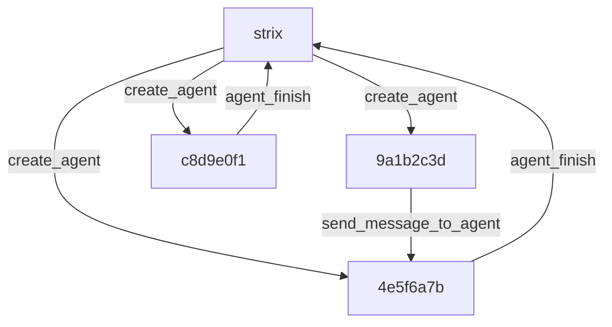

# The graph of agents

## Overview

Strix models multi-agent work as a tree with a single root agent, `strix`, whose `parent=None`. Each child agent gets a short 8-hex id under that root, and each agent id carries an `AgentRuntime` with `session`, `task`, and `wake` handles. `AgentCoordinator` in `strix/core/agents.py` owns the non-LLM control plane for that tree; it is not itself an agent. The root agent `strix` speaks in natural language and steers the branches.

See also [The agent loop](./03-the-agent-loop.md), which explains the lifecycle rules that this page describes. For broader product framing, use [Skills](https://docs.strix.ai/advanced/skills) and [scan modes](https://docs.strix.ai/usage/scan-modes).

The diagram below shows the root, three children, and the flows that matter most: spawn, message, and completion.

## The coordinator owns the tree

The coordinator keeps the tree real. `AgentCoordinator` stores the live status for every node, maps each child to its parent, and keeps the runtime snapshots that let Strix rebuild a scan later. It does this because a multi-agent scan needs a single control plane that can answer questions about membership, ancestry, and liveness without asking the LLM itself. The consequence is simple: the tree has a stable source of truth, and every other subsystem reads from it.

## Spawning stays detached

Child creation splits across `create_agent` in `strix/tools/agents_graph/tools.py` and `spawn_child_agent` in `strix/core/execution.py`. The graph tool asks the coordinator to register the new child, and the execution layer starts the child as a detached asyncio task so the parent keeps moving. This keeps the parent free to orchestrate while the child works in parallel, and it prevents the tree from turning into a single blocking call chain.

## Messages travel through agent sessions

Strix does not route agent communication through a separate message bus. `send_message_to_agent` and the coordinator's `send` path append the new message into the target agent's SDK session, update pending counts, and wake the waiting agent; `wait_for_message` and `consume_pending` pick that work back up. That choice keeps inter-agent traffic inside the same session model the SDK already uses, so the runtime avoids a second delivery system. The consequence is direct and predictable: a message becomes the next thing the target agent sees when it resumes.

## Inheritance at spawn

`child_initial_input` in `strix/core/inputs.py` folds the parent's prior context into the child's first user message along with the new task and identity line. That gives the child the background it needs without making it continue the parent's work, and it keeps providers that insist on strict role alternation from rejecting the turn. The result is a child that starts informed, but still owns its own branch.

## Termination is tool-gated

`agent_finish` is the child exit path. It marks the child `completed`, sends a completion report into the parent's inbox, and lets the parent decide what to do next. `finish_scan` in `strix/tools/finish/tool.py` is the root-only exit path; it persists the final report, refuses to finish while any child remains active, and sets the root agent to `completed` when the scan closes cleanly. That gate keeps [The agent loop](./03-the-agent-loop.md) honest, and the lifecycle tools themselves live with the rest of the toolkit layer in [The toolkit layer](./05-the-toolkit-layer.md).

## Resume rebuilds the tree

`run_strix_scan` treats resume as an "as of" capability. It reloads the coordinator snapshot, then `respawn_subagents` in `strix/core/execution.py` reconstructs only the non-terminal descendants from that snapshot and restarts them with their saved names, tasks, and skills. Finished branches stay finished, live branches come back, and the tree resumes from the same ancestry map instead of starting over.

## The tree is load bearing

`view_agent_graph` walks `parent_of` to render the hierarchy, and `stop_agent` can cancel a subtree by walking descendants in leaves-first order. Those behaviors work only because the tree shape carries real control meaning, not because the code keeps a flat pool of interchangeable workers. That is why the parent links matter everywhere from messaging to shutdown.

## Where to look in the code

- `strix/core/runner.py` — creates the root agent `strix`, installs `spawn_child_agent`, and respawns non-terminal children on resume.
- `strix/core/agents.py` — holds `AgentCoordinator`, `AgentRuntime`, status maps, parent links, pending counts, wake events, snapshots, and shutdown state.
- `strix/core/execution.py` — starts detached child tasks, opens child sessions, and rebuilds children from persisted state with `respawn_subagents`.
- `strix/core/inputs.py` — builds `child_initial_input`, which carries inherited context into a child's first user message.
- `strix/tools/agents_graph/tools.py` — exposes `view_agent_graph`, `create_agent`, `send_message_to_agent`, `wait_for_message`, `agent_finish`, and `stop_agent`.
- `strix/tools/finish/tool.py` and `strix/agents/factory.py` — enforce root-only scan completion and attach the lifecycle tools to root and child `SandboxAgent`s.