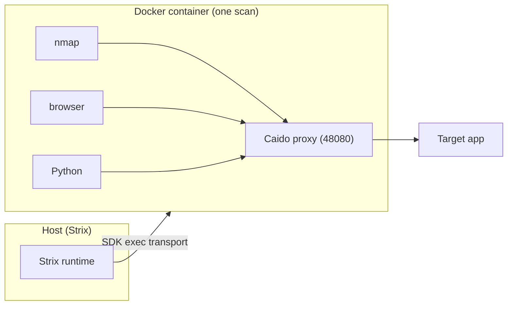

# The Docker Sandbox

## Overview

Strix uses a Docker container as the isolation model for each scan. The official [Sandbox Tools](/tools/sandbox) page lists the preinstalled tools inside that container; this page explains the boundary itself and the runtime that owns it. One container serves the whole agent tree, so sibling and child agents work inside the same workspace and network context.

For the broader scan and agent model, see [Anatomy of a scan](/01-anatomy-of-a-scan.md), [The graph of agents](/02-the-graph-of-agents.md), [The agent loop](/03-the-agent-loop.md), [The toolkit layer](/05-the-toolkit-layer.md), and [Seeing traffic, proxy, and browser](/06-seeing-traffic-proxy-and-browser.md).

## The mental model

The sandbox gives a scan a workspace boundary, a shared execution environment for shell and filesystem capabilities, and a Caido interception layer. Strix does not build container management from scratch. It subclasses the OpenAI Agents SDK Docker sandbox client in `strix/runtime/docker_client.py`, then changes the container creation path to fit Strix’s runtime.

The runtime keeps the ownership line clear. When an agent invokes shell or filesystem capabilities, the SDK sends the work through `session.exec()` into the container. Agents never call the Docker daemon directly. That keeps the toolkit layer focused on capability exposure while the runtime owns the container, the proxy, and the workspace layout.

## Lifecycle and ownership

`create_or_reuse()` in `strix/runtime/session_manager.py` builds the sandbox bundle for a scan ID. `build_session_entries()` splits local sources into copied manifest entries and read-only bind mounts. The session manager then sets the proxy environment variables that point at the in-container Caido listener, selects the Docker backend through `get_backend()`, creates the session, and calls `session.start()` so the manifest entries appear in the running container. It then caches the client, session, and Caido client under `scan_id`. A later call with the same scan ID returns that cached bundle instead of creating another container.

The backend registry currently ships `docker` only, but `register_backend()` keeps the API open for another runtime later. The Docker backend in `strix/runtime/backends.py` creates the Strix Docker sandbox client and starts the session because `client.create()` only builds the session object; `session.start()` performs the copy and mount work.

Teardown runs through `cleanup()`. That path closes the Caido client, deletes the container, and closes the Docker client. The code treats cleanup as best effort: any error gets logged, then the scan can continue to shut down. The runtime shutdown path calls this cleanup, and the CLI also invokes it defensively so a failed run does not leave the container behind.

## How tools reach the container

The container image gives the sandbox its execution surface. `containers/Dockerfile` installs `python3`, `nmap`, the agent browser, Caido, and the other security tools that the toolkit layer exposes. `containers/docker-entrypoint.sh` starts Caido, waits for a response, writes proxy settings, and installs the CA into browser trust so HTTPS traffic inside the container uses the same interception path.

The session manager sets HTTP and HTTPS proxy variables to the in-container listener, and `caido_bootstrap.py` logs in from inside the session, connects a host client, and selects a temporary project. Browser traffic and command line traffic then follow the same interception layer.

That design matters because the runtime sees only one container per scan. A root agent and every child agent share the same environment, so the tools in that container share the same workspace and proxy state. When a tool writes a file, opens a browser session, or launches a scanner, it does so inside that shared scan boundary.

## What Strix changes in the SDK container

`StrixDockerSandboxClient` in `strix/runtime/docker_client.py` reuses the SDK container client and replaces the container creation path with Strix-specific behavior. The code keeps the image entrypoint alive so `docker-entrypoint.sh` can launch Caido and prepare the container. It adds the Linux capabilities that raw socket tools need, maps `host.docker.internal` to the host gateway, and accepts optional resource limits and a log size cap so a runaway process does not fill the host disk. It also allows an optional custom network and supports read-only host bind mounts for large local repositories that would be too expensive to copy file by file.

The configuration page covers the image, backend, and size limits, so this page only points there: [Configuration](docs/advanced/configuration.mdx). The CLI page explains the read-only mount behavior and its limits: [CLI](docs/usage/cli.mdx).

## The isolation boundary is honest

> **Limitation**  
> The sandbox provides workspace isolation, not a hard security boundary. As of the current CLI docs, `--mount` uses a read-only bind mount for convenience, but a root process inside the container can remount it writable. That makes the feature appropriate for scanning trusted code, not for isolating hostile code. See the [CLI docs](docs/usage/cli.mdx) for the mount caveat.

## SDK pin and maintenance trade-off

This design keeps Strix coupled to `openai-agents[litellm]==0.14.6` in `pyproject.toml`. That coupling buys a small, precise set of container changes, but it also creates a maintenance cost: a future SDK upgrade requires re-merging the copied parent `_create_container()` body in `strix/runtime/docker_client.py`. Strix accepts that cost because the image entrypoint, host gateway mapping, and network capabilities depend on the override.

## Diagram

## Where to look in the code

- `strix/runtime/session_manager.py` — builds the per-scan bundle, sets proxy environment variables, caches by `scan_id`, and tears it down.
- `strix/runtime/docker_client.py` — subclasses the SDK Docker sandbox client and applies the Strix container changes.
- `strix/runtime/backends.py` — selects the Docker backend and calls `session.start()`.
- `strix/runtime/caido_bootstrap.py` — logs in to Caido from inside the session and selects a temporary project.
- `containers/Dockerfile` and `containers/docker-entrypoint.sh` — define the image, Caido startup, CA trust, and proxy bootstrap.
- `pyproject.toml` — pins `openai-agents[litellm]==0.14.6`.