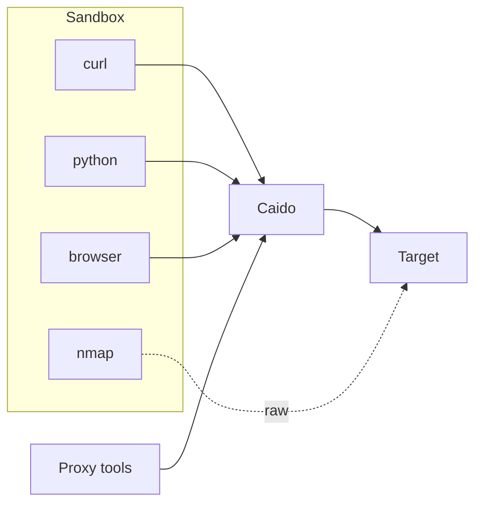

# Seeing Traffic Through the Proxy Rail

Strix intercepts traffic through the environment, not through per tool instrumentation. One sandbox, one Caido sidecar, and one browser path share the same boundary, so `curl`, Python, and `agent-browser` all ride the same rail when they honor the injected proxy settings.

## Overview

The design centers on a single sandbox per scan and a single proxy control plane. `containers/docker-entrypoint.sh` starts `caido-cli` inside the container, exports the proxy variables system wide, and installs the local CA into both the system trust store and the browser trust store. That CA lets Caido decrypt HTTPS inside the sandbox, while `http_proxy`, `https_proxy`, `ALL_PROXY`, and `NO_PROXY` give proxy-aware clients a shared route out.

`strix/runtime/session_manager.py` injects the same proxy values into the per scan manifest, exposes Caido's port, and caches the bundle by `scan_id`, so the whole agent tree shares one container and one Caido instance. `strix/runtime/caido_bootstrap.py` then logs in as guest from inside the container and creates the host-side Caido client against the exposed endpoint.

`strix/runtime/docker_client.py` preserves the image entrypoint, keeps the container alive with `tail -f /dev/null`, adds `NET_ADMIN` and `NET_RAW`, and maps `host.docker.internal` to `host-gateway`. That keeps host-served targets reachable and also marks the edge of the proxy boundary: traffic from proxy-aware clients flows through Caido, while raw network tools such as `nmap` still use their own network capabilities.

The [Sandbox Tools](./docs/tools/sandbox.mdx) catalog lists preinstalled utilities. It does not describe container isolation.

## The Caido control plane

`strix/tools/proxy/caido_api.py` owns the shared Caido client cache and the `_CLIENT_LOCK`. `strix/tools/proxy/tools.py` layers `_CAIDO_CALL_LOCK` on top and exposes `list_requests`, `view_request`, `repeat_request`, `list_sitemap`, `view_sitemap_entry`, and `scope_rules` as thin wrappers around the same client.

The locks matter because Caido's GraphQL transport does not tolerate concurrent use. Two concurrent calls can race and raise `Transport is already connected`, so serialization is a correctness requirement, not a convenience. Once a request lands in Caido, the control plane turns it into a working surface: `view_request` inspects it, `repeat_request` replays it with changes, and the sitemap helpers turn captured traffic into a searchable map of the discovered surface.

`scope_rules` acts as the guardrail. It keeps the scan focused on the authorized target by shaping which hosts Caido records and which hosts it ignores.

## The browser rides the same rail

The browser path uses the same interception boundary as shell traffic. `strix/agents/prompt.py` always loads `tooling/agent_browser`, so the browser skill appears in every agent prompt. `strix/tools/agent_browser/README.md` and `containers/Dockerfile` show the runtime shape more clearly: the sandbox installs `agent-browser@0.26.0`, points it at Chromium, and drives it through `exec_command` rather than a dedicated function tool.

Because `agent-browser` runs inside the container, it inherits the same proxy environment as `curl` and Python. Its requests appear in Caido, which makes the browser another way to exercise the same rail instead of a separate subsystem. During an interactive scan, an operator can open Caido, inspect captured traffic, and intervene before the next request continues.

For procedure and command syntax, see [HTTP Proxy](https://docs.strix.ai/tools/proxy) and [Browser](https://docs.strix.ai/tools/browser).

## Where to look in the code

- `containers/docker-entrypoint.sh` starts `caido-cli`, exports proxy variables, and installs the CA into the system and browser trust stores.
- `strix/runtime/session_manager.py` builds the per scan manifest, injects the proxy env vars, exposes port `48080`, and caches the bundle by `scan_id`.
- `strix/runtime/docker_client.py` keeps the image entrypoint, holds the container open with `tail -f /dev/null`, adds `NET_ADMIN` and `NET_RAW`, and maps `host.docker.internal`.
- `strix/runtime/caido_bootstrap.py` logs in as guest from inside the container and creates the host-side Caido client.
- `strix/tools/proxy/caido_api.py` and `strix/tools/proxy/tools.py` share the client, serialize access, and expose request, scope, and sitemap helpers.
- `strix/agents/prompt.py`, `strix/tools/agent_browser/README.md`, and `strix/skills/tooling/agent_browser.md` show how the browser path loads and inherits the proxy rail.