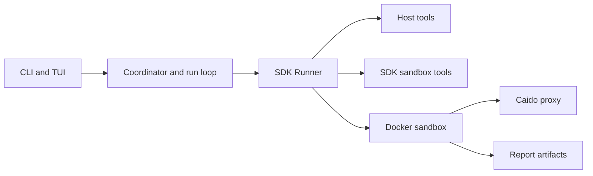

Strix runs on top of the OpenAI Agents SDK (`openai-agents[litellm]==0.14.6` in `pyproject.toml`). The SDK owns the single-agent execution loop, the sandbox client, and the shell, filesystem, `apply_patch`, and `view_image` capabilities; Strix layers scan orchestration, prompting, skills, Docker and proxy customizations, reporting, telemetry, and the CLI and TUI around that core. This guide covers the connective architecture that the official docs at [Quickstart](https://docs.strix.ai/quickstart) and [Skills](https://docs.strix.ai/advanced/skills) leave to the reference pages.

## Package map

- `strix/interface/` — CLI and Textual TUI entry points (`main.py`, `cli.py`, `tui/`).
- `strix/core/` — orchestration and lifecycle control (`runner.py`, `execution.py`, `agents.py`, `hooks.py`, `inputs.py`).
- `strix/agents/` — agent construction and prompt context (`factory.py`, `prompt.py`, system prompt Jinja).
- `strix/tools/` — host side function tools plus README stubs for SDK sandbox tools.
- `strix/runtime/` — Docker sandbox lifecycle and Caido proxy setup.
- `strix/report/` — findings state and artifact writers.
- `strix/telemetry/` — product analytics and per-scan logging.
- `strix/config/` — settings and model/provider wiring.
- `strix/skills/` — pentest playbooks injected into prompts; the concept page already lives in the official docs.

The sandbox image definition lives in the repo root `containers/`, not under `strix/`.

## Scan spine

1. `strix/interface/main.py` starts the run, collects the scan inputs, and hands off to `run_strix_scan` in `strix/core/runner.py`.
2. `run_strix_scan` creates the `AgentCoordinator` in `strix/core/agents.py` and brings up one Docker sandbox and its Caido proxy through `strix/runtime/session_manager.py`.
3. The runner builds the root agent with `build_strix_agent` in `strix/agents/factory.py`.
4. `strix/core/execution.py` enters the run loop, the SDK `Runner` drives model and tool activity, and the loop can spawn child agents when the task branches.
5. Findings land in `ReportState` in `strix/report/state.py`, and the root agent's `finish_scan` writes report artifacts under `strix_runs/<run>/`.

## Architecture diagram

## Where to look in the code

- `strix/interface/main.py`, `strix/interface/cli.py`, `strix/interface/tui/` — entry points and the user facing run flow; see [Anatomy of a scan](./01-anatomy-of-a-scan.md).
- `strix/core/runner.py`, `strix/core/agents.py`, `strix/core/execution.py`, `strix/core/hooks.py`, `strix/core/inputs.py` — scan orchestration, graph state, and loop control; see [The graph of agents](./02-the-graph-of-agents.md) and [The agent loop](./03-the-agent-loop.md).
- `strix/runtime/session_manager.py`, `strix/runtime/docker_client.py`, `containers/` — per-scan sandbox lifecycle and container customizations; see [The Docker sandbox](./04-the-docker-sandbox.md).
- `strix/agents/factory.py`, `strix/agents/prompt.py`, `strix/skills/` — prompt assembly and skill injection; see [The toolkit layer](./05-the-toolkit-layer.md) and the official [Skills](https://docs.strix.ai/advanced/skills) page.
- `strix/tools/`, especially `strix/tools/proxy/tools.py` — host side tools and proxy wrappers; see [Seeing traffic, proxy, and browser](./06-seeing-traffic-proxy-and-browser.md) and the official [Quickstart](https://docs.strix.ai/quickstart).
- `strix/telemetry/logging.py`, `strix/config/models.py`, `strix/report/state.py`, `strix/report/writer.py` — logs, model wiring, and report artifacts; see [Telemetry, logging, and usage](./07-telemetry-logging-and-usage.md), [From finding to report](./08-from-finding-to-report.md), and [About this site](./09-about-this-site.md).