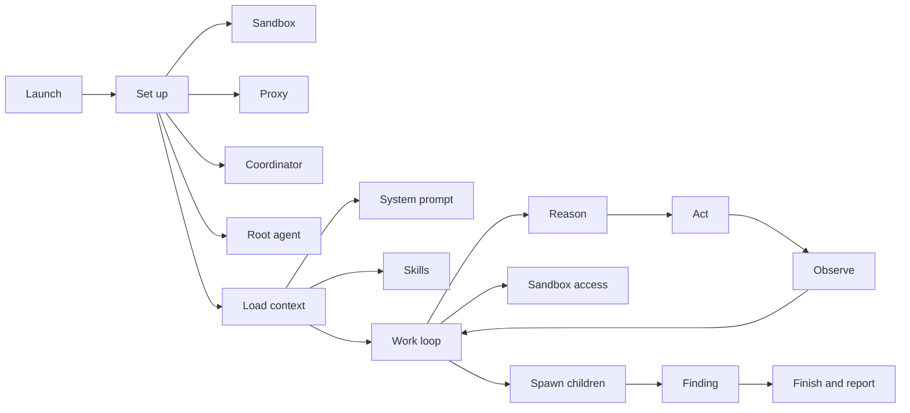

# Anatomy of a Scan

Strix scans run on the OpenAI Agents SDK. The SDK runner drives the loop; Strix wraps that runner with orchestration, prompting, sandboxing, proxying, and reporting so the scan behaves like a complete product flow instead of a bare model call.

The sections below describe the shape of that pipeline at a high level, not the individual API calls inside it.

## Starting a scan

`strix` turns a command into a live scan by validating the environment, making sure the sandbox image is present, and handing off to either the interactive TUI or a headless run for CI. From there it becomes a running investigation rather than a one-off command.

The launch mechanics belong in the official [quickstart](https://docs.strix.ai/quickstart) and [CLI reference](https://docs.strix.ai/usage/cli), so this page stays focused on the architecture of the scan itself.

## Setting the stage

Each scan gets one Docker sandbox for the whole agent tree. The Caido proxy sits beside that sandbox and intercepts traffic, while the `AgentCoordinator` keeps track of agents, inboxes, and state. The root agent carries the natural language side of the investigation, but the coordinator handles the control plane.

For the sandbox boundary itself, see [the Docker sandbox](./04-the-docker-sandbox.md). For the traffic path through the proxy and browser, see [seeing traffic](./06-seeing-traffic-proxy-and-browser.md).

## How the agent knows how to hack

The agent starts with a system prompt from `strix/agents/prompts/system_prompt.jinja`, and `strix/agents/prompt.py` renders that prompt for each run. Skills enter through `strix/skills/` and `strix/tools/load_skill/tool.py`, following the already documented Skills concept on the official [Skills page](https://docs.strix.ai/advanced/skills).

Strix does not hard code a rigid phase machine. Instead, the system prompt, the dedicated `think` tool in `strix/tools/thinking/tool.py`, and the todo tools in `strix/tools/todo/tools.py` nudge the model to reason before acting. That keeps the scan adaptive while still pushing it toward deliberate progress. For the loop mechanics, see [the agent loop](./03-the-agent-loop.md).

## Working the target

The live scan runs through the SDK `Runner.run_streamed`, which keeps the model moving through a reason → act → observe cycle. Strix layers the capabilities around that stream: shell and filesystem access from `agents.sandbox.capabilities`, proxy tools from `strix/tools/proxy/tools.py`, and the interactive browser and terminal surface that Strix exposes to the agent.

This part of the system is exploratory and evidence driven. The agent tries an action, reads the result, and follows whatever the target reveals next. For the loop itself and the toolkit boundary, see [the agent loop](./03-the-agent-loop.md) and [the toolkit layer](./05-the-toolkit-layer.md).

## Scaling out

When one thread of work is not enough, `AgentCoordinator` in `strix/core/agents.py` extends the tree. `spawn_child_agent` and `respawn_subagents` in `strix/core/execution.py` create and recover children, and the multi agent graph tools in `strix/tools/agents_graph/tools.py` make that tree visible to the run.

The shape matters more than the count. Parent and child agents let Strix keep local work local, while the root agent stays responsible for the whole scan. For the graph view, see [the graph of agents](./02-the-graph-of-agents.md).

## Finding, validating, reporting

Strix records findings only after live validation. `create_vulnerability_report` and `create_dependency_report` in `strix/tools/reporting/tool.py` capture the evidence, `strix/report/state.py` persists the run state, and `strix/report/writer.py` turns that state into the final report.

This is validated, not pattern matched. Findings surface immediately in the UI, then roll into the run report once the evidence holds up. For the path from finding to report, see [from finding to report](./08-from-finding-to-report.md).

## Finishing

A scan ends only when the root agent calls `finish_scan` in `strix/tools/finish/tool.py`. A claim of completion does nothing on its own; the explicit finish call closes the run, and Strix tears down the sandbox afterward.

Headless mode then uses the exit status to signal CI. For the end of the loop, see [the agent loop](./03-the-agent-loop.md).

## Where to look in the code

- `strix/agents/prompts/system_prompt.jinja` — scan framing prompt.
- `strix/agents/prompt.py` — prompt rendering and skill injection.
- `strix/core/agents.py` and `strix/core/execution.py` — `AgentCoordinator`, `spawn_child_agent`, and `respawn_subagents`.
- `strix/tools/reporting/tool.py` — `create_vulnerability_report` and `create_dependency_report`.
- `strix/report/state.py` and `strix/report/writer.py` — finding persistence and report rendering.
- `strix/tools/finish/tool.py` — `finish_scan`.
