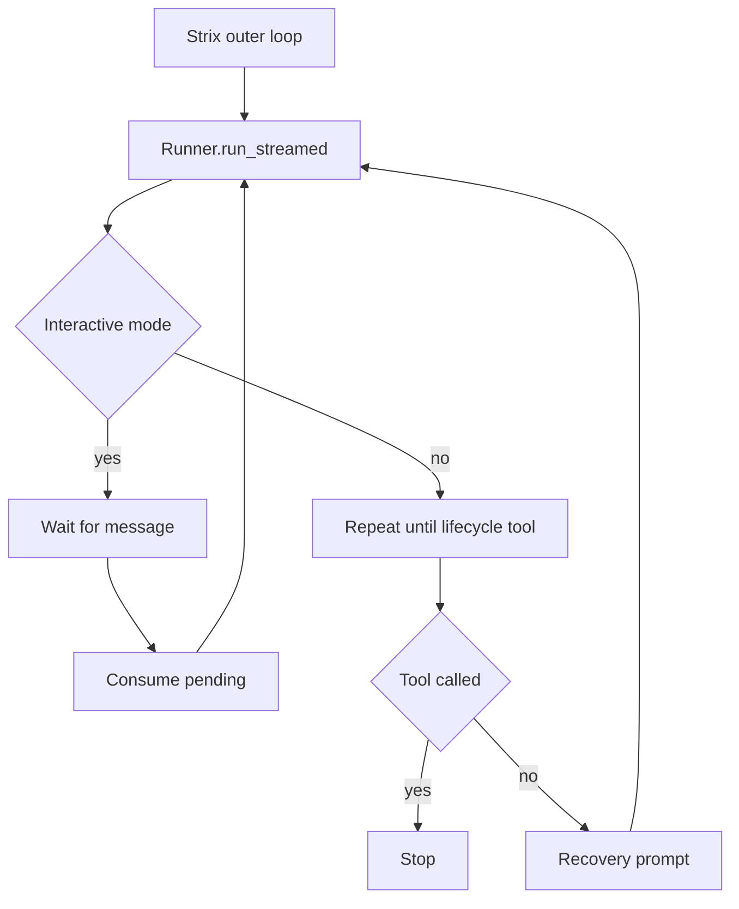

# The Agent Loop

The OpenAI Agents SDK owns the inner reason, act, and observe cycle through `Runner.run_streamed`. Strix wraps that stream with policy in `strix/core/execution.py`: it watches each turn, decides when to park, when to retry, when to stop on lifecycle tools, and when to settle a scan. That split matters in practice because Strix observes the model stream rather than rebuilding it, so the SDK keeps control of the conversation while Strix keeps control of scan policy. The familiar think-plan-act-observe story only works here as a behavioral shorthand: Strix does not implement a separate state machine, and the code never names one.

This matters because the SDK handles the model, tool, and result loop, while Strix carries the policy around the whole run. One scan reuses a single sandbox session bundle, one coordinator, one budget ledger, and one set of lifecycle rules. That arrangement keeps the model loop stable and gives Strix room to change policy without changing how the SDK executes a turn. For the wider map, see [The Big Picture](./00-the-big-picture.md), [Anatomy of a Scan](./01-anatomy-of-a-scan.md), and [The Graph of Agents](./02-the-graph-of-agents.md).

## What the SDK owns

`_run_cycle` calls `Runner.run_streamed(...)` and then relays the streamed events to the optional `event_sink`. That sink acts as the control plane bridge to the UI and other observers: it mirrors what happened without asking Strix to own the turn itself. The SDK still drives the tool calls, the model response, and the final result object; Strix watches the stream and reacts around the edges.

`make_model_settings(...)` tightens the SDK call site before the run starts. It disables parallel tool calls, always includes usage, and can force required tool choice for supported OpenAI family models. Those settings shape how the model behaves, but they do not create a separate code phase. The surrounding configuration surfaces expose adjacent knobs such as reasoning effort and the budget flag; see [the official configuration docs](https://docs.strix.ai/advanced/configuration) and [the CLI usage docs](https://docs.strix.ai/usage/cli) for those inputs.

The apparent discipline inside the agent comes from prompting and tools, not from a Strix coded phase machine. The system prompt in `strix/agents/prompts/system_prompt.jinja` tells the model how to behave, the private `think` tool gives it a place to record reasoning without side effects, and the todo tools keep its work visible and structured. The prompt, tools, and SDK execution combine to produce disciplined behavior, but Strix still relies on the SDK loop instead of layering on a second one of its own.
The prompt and tool setup give the model a deliberative workspace, but the SDK still sets the cadence of each turn. `think` records reasoning without side effects, and the todo tools expose visible state for planning and follow through. Those tools shape the model's posture, while the SDK loop still moves each turn forward.

## What Strix wraps around it

`run_agent_loop` adds the outer control loop. In interactive mode, it runs one cycle, then parks on `coordinator.wait_for_message(agent_id)`. When a message arrives, Strix calls `consume_pending(...)` and starts another `_run_cycle`. That pattern keeps the scan alive while it waits for fresh input, and it gives a human or peer agent a chance to steer between turns without tearing down the session.

In noninteractive mode, `_run_noninteractive_until_lifecycle` keeps repeating `_run_cycle` until a lifecycle tool settles the agent. `finish_scan` ends the root agent and `agent_finish` ends a child agent, and the broader tree behavior belongs on [The Graph of Agents](./02-the-graph-of-agents.md). If the model produces a text-only final answer instead of calling a lifecycle tool, Strix injects a recovery message that demands exactly one tool call and tries again, up to `max_turns`. That recovery message keeps the run aligned with the lifecycle contract, and the retry cap keeps a bad turn from looping forever.
`wait_for_message` and `consume_pending` preserve the inbox driven handoff from one turn to the next in interactive runs. The noninteractive recovery path serves a different purpose: it keeps a run from ending silently on prose alone when the lifecycle contract still expects an explicit tool call.

## Guardrails and termination

Strix treats termination as gated by tool calls, not prose. The run settles when the agent calls `finish_scan` or `agent_finish`; parking on `wait_for_message` remains the other valid resting state. That rule matters because the run can sound finished long before the tree has a concrete completion signal, and Strix needs that signal to keep parent and child agents in a known state. `ReportUsageHooks` records SDK usage after each model response, and it raises `BudgetExceededError` once the accumulated cost reaches `max_budget_usd`. That exception stops the scan and wakes parked agents so the tree can unwind cleanly.

The model settings reinforce that shape. `make_model_settings(...)` keeps tool calls serialized and usage visible, so the coordinator and the usage ledger can make decisions from the same stream of facts. The result is a loop that favors explicit tool actions over plain final text, which matches the lifecycle contract on [The Graph of Agents](./02-the-graph-of-agents.md).

## Robustness and persistence

The loop absorbs a few common failure modes when the model or the runtime misbehaves. Before each cycle, Strix enforces the image budget from `max_context_images`. If the model rejects a turn because older screenshots still pollute the session, Strix strips all images from the session and retries, up to three times. Those retries protect normal runs from stale visual context without masking a real failure. `_run_cycle` also ignores the LiteLLM "after shutdown" end-of-stream race and tolerates sandbox teardown errors once shutdown has already started.

Persistence follows the same split. `session_manager.create_or_reuse(...)` keeps one sandbox session bundle per scan, not per agent, so the whole tree shares the same container boundary. The sandbox session gives the scan its live workspace, while the SQLite session in `.state/agents.db` gives each agent its durable memory. `AgentCoordinator` keeps the live control plane state around it: statuses, pending inbox counts, runtime handles, and the wait/consume flow that drives interactive parking. The context dict also survives from cycle to cycle, which lets the loop carry budget, scope, and parent metadata forward without rebuilding it each time.
The shared sandbox gives the scan one isolation boundary, while the SQLite memory keeps agent-local state across cycles. That split lets Strix keep one isolation boundary while still retaining per-agent memory and coordinator state across multiple cycles.

`child_initial_input(...)` matters here as well. It packages inherited context, agent identity, parent identity, and the new task into one user message so the next SDK turn starts cleanly, even with providers that reject consecutive user messages. That keeps child runs predictable and keeps the tree coherent because each child starts with the right identity and inherited context already in place.

## Where to look in the code

- `strix/core/execution.py` — the outer loop, `Runner.run_streamed`, lifecycle settling, interactive parking, budget stopping, image recovery, and crash notification.
- `strix/core/inputs.py` — model settings, required tool choice, usage inclusion, and child turn seeding.
- `strix/core/agents.py` — coordinator state, pending inboxes, status changes, runtime attachment, and resume snapshots.
- `strix/core/sessions.py` — SQLite session helpers, image budgeting, and image stripping recovery.
- `strix/core/hooks.py` — usage recording and the budget stop exception.
- `strix/runtime/session_manager.py` and `strix/runtime/docker_client.py` — the per scan sandbox boundary and the container behavior that supports it.
